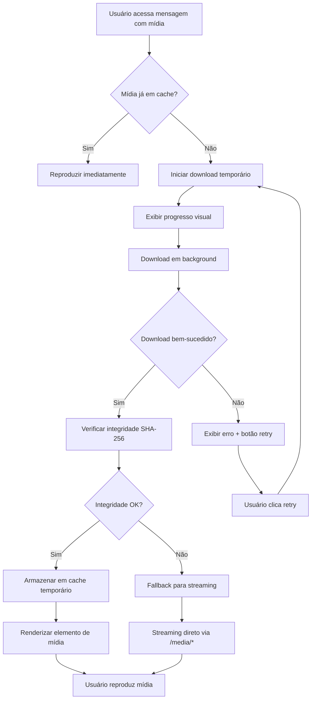
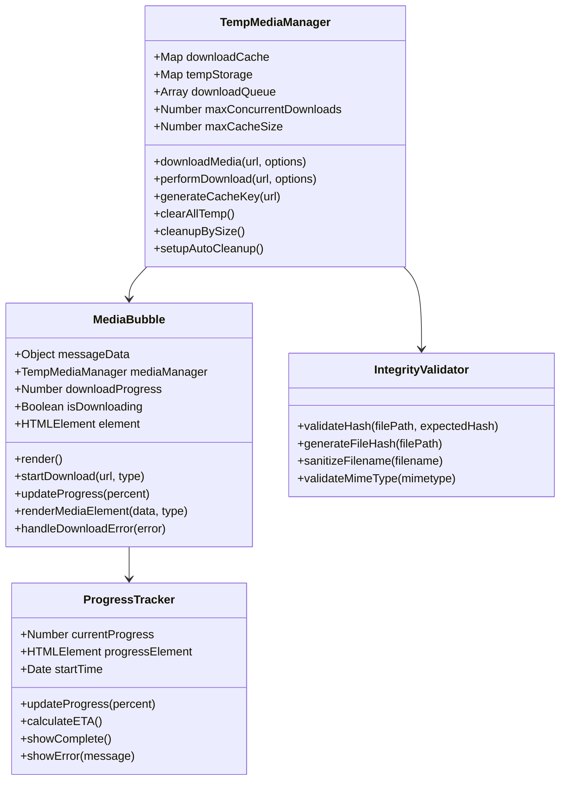
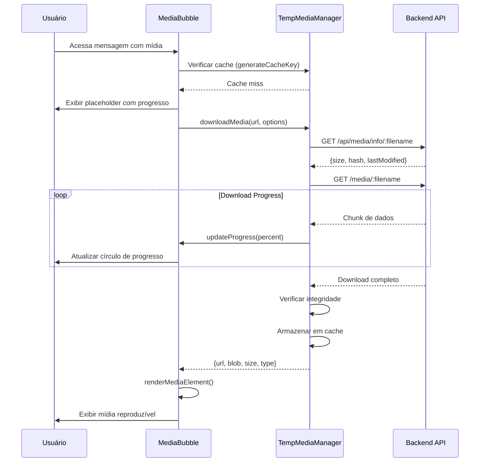
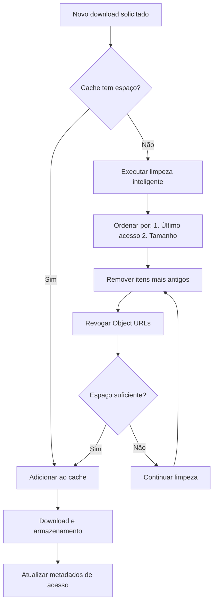
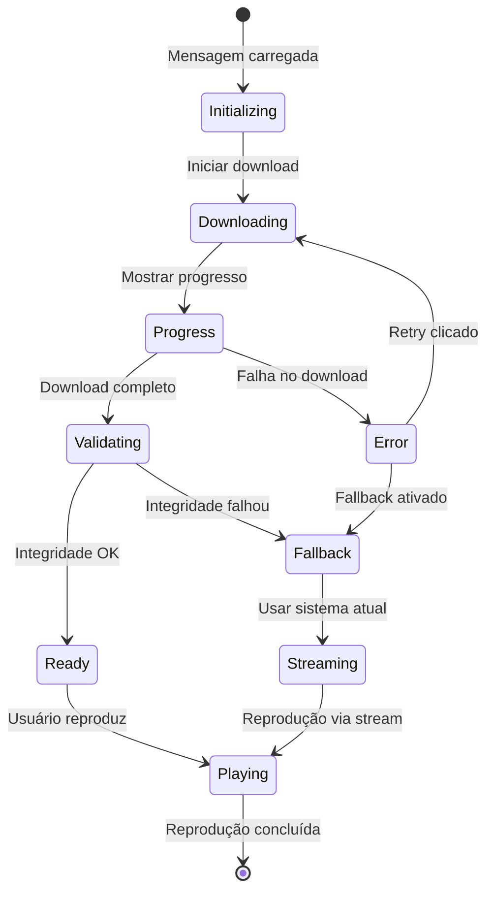
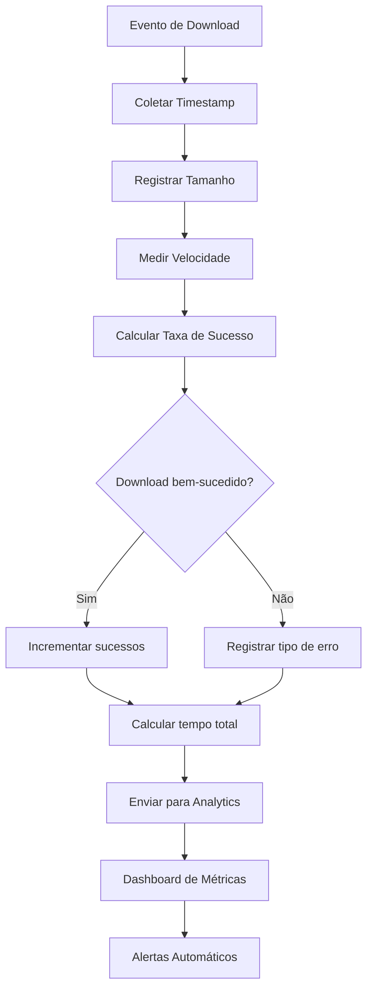
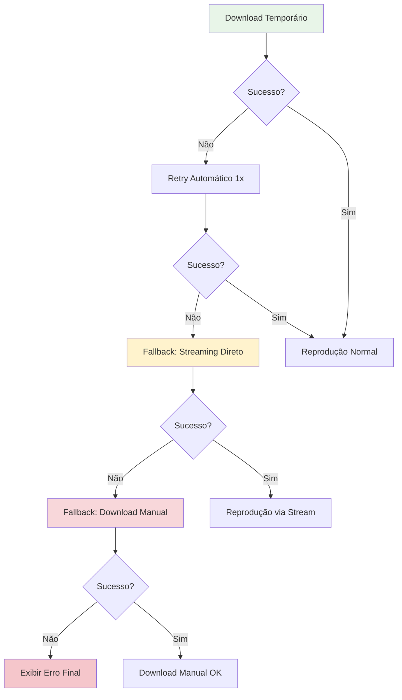
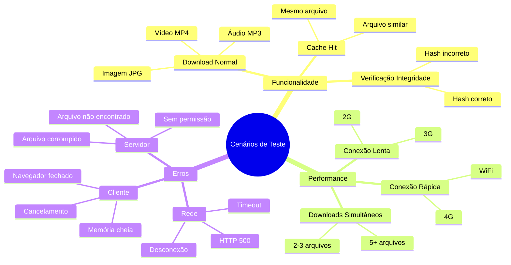

# 🔄 Fluxograma Técnico: Sistema de Download Temporário de Mídia

## 📊 Visão Geral do Fluxo



---

## 🏗️ Arquitetura Detalhada do Sistema

### **1. Componentes Principais**



---

## 🔄 Fluxo Detalhado de Download

### **Fase 1: Inicialização**



### **Fase 2: Gestão de Cache**



---

## 🎨 Estados Visuais da Interface

### **Estados do Balão de Mídia**



### **Componentes Visuais por Estado**

| Estado | Elementos Visuais | Ações Disponíveis |
|--------|-------------------|--------------------|
| **Initializing** | Spinner + "Preparando..." | Nenhuma |
| **Downloading** | Círculo de progresso + % | Cancelar |
| **Progress** | Barra + ETA + velocidade | Cancelar |
| **Validating** | Spinner + "Verificando..." | Nenhuma |
| **Error** | Ícone erro + mensagem | Retry, Fallback |
| **Ready** | Player de mídia completo | Play, Pause, Seek |
| **Fallback** | Player com indicador stream | Play (streaming) |

---

## 🔧 Integração com Sistema Atual

### **Pontos de Integração**

```mermaid
graph LR
    subgraph "Sistema Atual"
        A[app.js - Recebimento WhatsApp]
        B[database.js - Armazenamento]
        C[/media/* - Servimento]
        D[script.js - Renderização]
    end
    
    subgraph "Novo Sistema"
        E[TempMediaManager]
        F[MediaBubble]
        G[API Metadados]
        H[Verificação Integridade]
    end
    
    A --> B
    B --> G
    C --> E
    D --> F
    E --> H
    F --> C
    
    style E fill:#e1f5fe
    style F fill:#e1f5fe
    style G fill:#e1f5fe
    style H fill:#e1f5fe
```

### **Modificações Necessárias**

#### **Backend (Mínimas)**
```javascript
// 1. Adicionar endpoint de metadados
app.get('/api/media/info/:filename', requireAuth, getMediaInfo);

// 2. Adicionar middleware de integridade
app.use('/media/:filename', validateIntegrity);

// 3. Manter sistema atual como fallback
// Nenhuma modificação nas rotas existentes
```

#### **Frontend (Evolutivas)**
```javascript
// 1. Substituir renderização de mídia
// De: HTML direto
// Para: MediaBubble component

// 2. Adicionar TempMediaManager
// Novo: Sistema de cache temporário

// 3. Manter compatibilidade
// Fallback automático para sistema atual
```

---

## 📊 Métricas e Monitoramento

### **Fluxo de Coleta de Métricas**



### **KPIs Principais**

```javascript
// Estrutura de métricas coletadas
const metrics = {
  downloads: {
    total: 0,
    successful: 0,
    failed: 0,
    avgTime: 0,
    avgSize: 0,
    avgSpeed: 0
  },
  cache: {
    hits: 0,
    misses: 0,
    hitRate: 0,
    currentSize: 0,
    maxSize: 100 * 1024 * 1024
  },
  errors: {
    network: 0,
    integrity: 0,
    timeout: 0,
    other: 0
  },
  performance: {
    timeToFirstByte: 0,
    timeToComplete: 0,
    memoryUsage: 0
  }
};
```

---

## 🚨 Tratamento de Erros

### **Hierarquia de Fallbacks**



### **Tipos de Erro e Respostas**

| Tipo de Erro | Causa Provável | Ação Automática | Ação do Usuário |
|--------------|----------------|-----------------|------------------|
| **Network Timeout** | Conexão lenta | Retry com timeout maior | Tentar novamente |
| **HTTP 404** | Arquivo não encontrado | Fallback para streaming | Reportar erro |
| **HTTP 403** | Sem permissão | Reautenticar | Fazer login |
| **Integrity Fail** | Arquivo corrompido | Fallback para streaming | Download manual |
| **Memory Full** | Cache lotado | Limpeza automática | Aguardar |
| **Abort** | Cancelado pelo usuário | Limpar recursos | Tentar novamente |

---

## 🔄 Ciclo de Vida do Cache

### **Gestão Automática de Memória**

```mermaid
gantt
    title Ciclo de Vida dos Arquivos em Cache
    dateFormat X
    axisFormat %s
    
    section Download
    Requisição     :0, 1
    Download       :1, 3
    Verificação    :3, 4
    
    section Cache
    Armazenamento  :4, 5
    Uso Ativo      :5, 300
    Idle           :300, 600
    
    section Limpeza
    Marcação LRU   :600, 601
    Remoção        :601, 602
    Liberação      :602, 603
```



### **Algoritmo de Limpeza LRU**

```javascript
// Pseudocódigo do algoritmo de limpeza
function cleanupBySize() {
  const entries = Array.from(this.tempStorage.entries());
  
  // Ordenar por: 1. Último acesso, 2. Tamanho
  entries.sort((a, b) => {
    const aAccess = a[1].lastAccessed || 0;
    const bAccess = b[1].lastAccessed || 0;
    
    if (aAccess !== bAccess) {
      return aAccess - bAccess; // Mais antigo primeiro
    }
    
    return b[1].size - a[1].size; // Maior primeiro
  });
  
  let currentSize = this.getCurrentCacheSize();
  const targetSize = this.maxCacheSize * 0.8; // 80% do limite
  
  for (const [key, data] of entries) {
    if (currentSize <= targetSize) break;
    
    URL.revokeObjectURL(data.url);
    this.tempStorage.delete(key);
    currentSize -= data.size;
  }
}
```

---

## 🎯 Cenários de Teste

### **Casos de Uso Principais**



### **Matriz de Compatibilidade**

| Navegador | Versão Mínima | Suporte Blob URLs | Suporte Fetch | Status |
|-----------|---------------|-------------------|---------------|--------|
| **Chrome** | 60+ | ✅ | ✅ | Completo |
| **Firefox** | 55+ | ✅ | ✅ | Completo |
| **Safari** | 12+ | ✅ | ✅ | Completo |
| **Edge** | 79+ | ✅ | ✅ | Completo |
| **Mobile Chrome** | 60+ | ✅ | ✅ | Completo |
| **Mobile Safari** | 12+ | ✅ | ✅ | Completo |
| **IE 11** | - | ❌ | ❌ | Fallback |

---

## 📋 Checklist de Implementação

### **Fase 1: Infraestrutura**
- [ ] **TempMediaManager.js**
  - [ ] Sistema de cache Map-based
  - [ ] Gestão de downloads concorrentes
  - [ ] Limpeza automática por tamanho
  - [ ] Geração de cache keys únicos
  
- [ ] **API Backend**
  - [ ] Endpoint `/api/media/info/:filename`
  - [ ] Middleware de verificação de integridade
  - [ ] Sanitização de nomes de arquivos
  - [ ] Headers de segurança

- [ ] **Testes Unitários**
  - [ ] TempMediaManager methods
  - [ ] Cache management
  - [ ] Error handling
  - [ ] Memory cleanup

### **Fase 2: Interface**
- [ ] **MediaBubble.js**
  - [ ] Renderização de estados
  - [ ] Animações de progresso
  - [ ] Tratamento de erros
  - [ ] Integração com TempMediaManager
  
- [ ] **CSS Styles**
  - [ ] Progress circles e bars
  - [ ] Estados visuais
  - [ ] Animações de transição
  - [ ] Responsividade mobile

- [ ] **Testes de Interface**
  - [ ] Renderização correta
  - [ ] Interações do usuário
  - [ ] Estados de erro
  - [ ] Responsividade

### **Fase 3: Otimização**
- [ ] **Performance**
  - [ ] Compressão automática
  - [ ] Paralelização de downloads
  - [ ] Pré-carregamento inteligente
  - [ ] Métricas de performance
  
- [ ] **Monitoramento**
  - [ ] Coleta de métricas
  - [ ] Dashboard de analytics
  - [ ] Alertas automáticos
  - [ ] Logs estruturados

- [ ] **Testes de Carga**
  - [ ] Downloads simultâneos
  - [ ] Stress test de memória
  - [ ] Simulação de rede lenta
  - [ ] Teste de fallback

---

**Documento gerado em:** " + new Date().toLocaleDateString('pt-BR') + "
**Versão:** 1.0
**Complementa:** ANALISE_EVOLUCAO_DOWNLOAD_TEMPORARIO_MIDIA.md
**Autor:** Analista de Sistemas Sênior